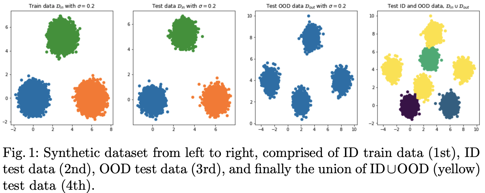
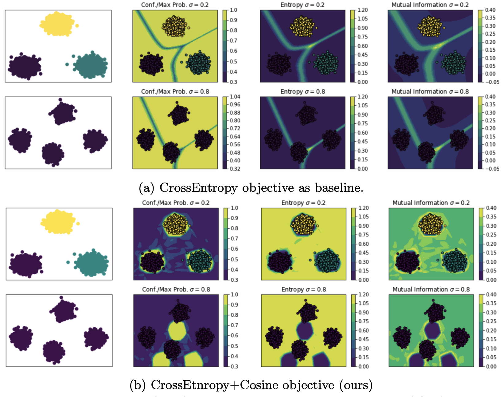
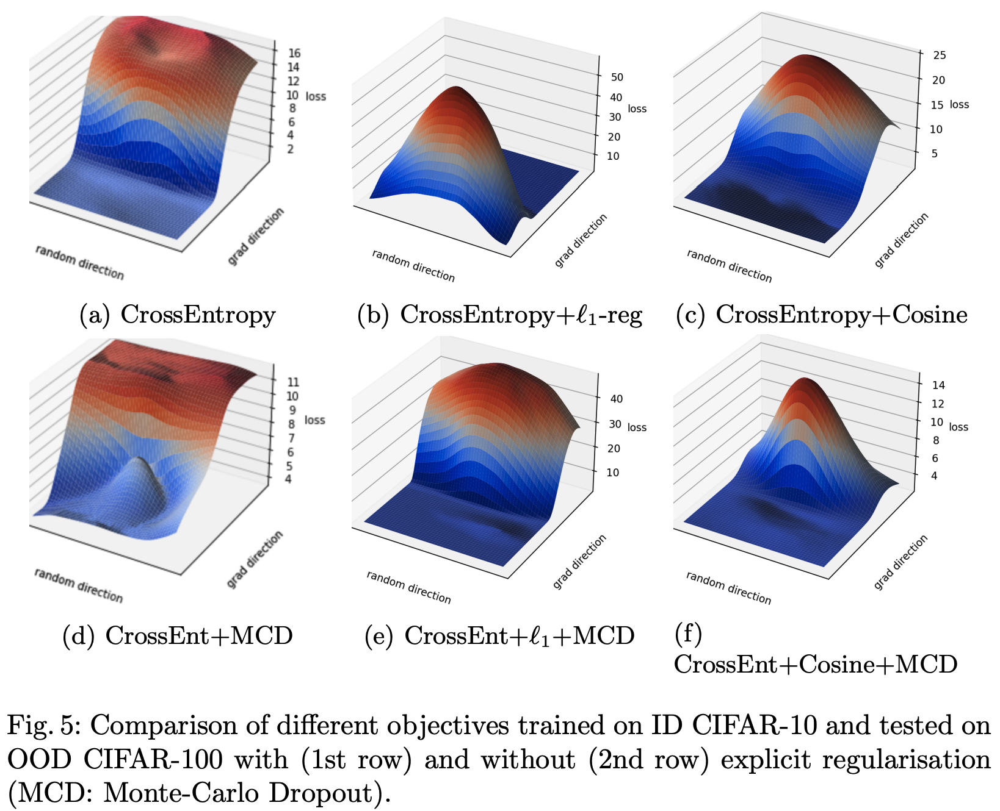

# RAIOOD
On the Importance of **R**egularisation and **A**uxiliary **I**nformation in **OOD** Detection

- Datasets

  | Train/In Distribution | Test/Out Distribution |
  | --------------------- | --------------------- |
  | CIFAR10               | {CIFAR100, SVHN, LSUN}|
  | FashionMNIST          | {CIFAR100, CIFAR10, LSUN}|
  | CIFAR100              | {CIFAR10, SVHN, LSUN}|
  | SVHN                  | {CIFAR100, CIFAR10, LSUN}|






- Cite
```
@inproceedings{mitros2021,
  author    = {John Mitros and Brian Mac Namee},
  title     = {On the Importance of Regularisation and Auxiliary Information in {OOD}
               Detection},
  booktitle = {Neural Information Processing - 28th International Conference, {ICONIP}},
  series    = {Communications in Computer and Information Science},
  volume    = {1517},
  pages     = {361--368},
  publisher = {Springer},
  year      = {2021},
  url       = {https://doi.org/10.1007/978-3-030-92310-5_42},
  doi       = {10.1007/978-3-030-92310-5_42},
}
```
